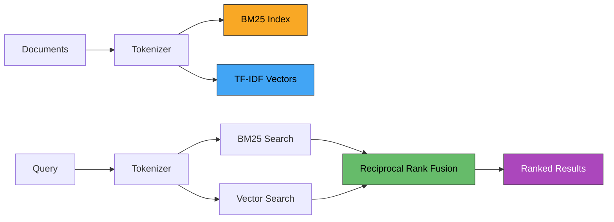

# HybridFind

[](https://github.com/MukundaKatta/HybridFind/actions/workflows/ci.yml)
[](https://www.python.org/downloads/)
[](LICENSE)

**Hybrid semantic + keyword search** — combines BM25 lexical matching with TF-IDF vector similarity, fused via Reciprocal Rank Fusion (RRF). Built for RAG pipelines and information retrieval systems.

---

## How It Works



## Features

- **BM25 keyword search** — implemented from scratch, no external search libs
- **TF-IDF vector similarity** — cosine similarity over sparse TF-IDF vectors
- **Reciprocal Rank Fusion** — weighted merging of both result sets
- **Metadata filtering** — filter results by arbitrary metadata fields
- **Configurable weights** — tune the balance between keyword and semantic search
- **CLI included** — index a directory and search from the terminal
- **Zero heavy dependencies** — only pydantic, typer, and rich

## Installation

```bash
pip install -e .
```

## Quick Start

### Python API

```python
from hybridfind import HybridSearch, SearchConfig

# Configure (optional)
config = SearchConfig(bm25_weight=0.6, vector_weight=0.4, top_k=5)
engine = HybridSearch(config=config)

# Add documents
engine.add_documents(
    texts=[
        "Python is great for data science",
        "Machine learning requires large datasets",
        "Search engines combine keyword and semantic matching",
    ],
    ids=["doc1", "doc2", "doc3"],
    metadatas=[
        {"category": "programming"},
        {"category": "ml"},
        {"category": "search"},
    ],
)

# Search
results = engine.search("data science programming")
for r in results:
    print(f"{r.doc_id}: {r.score:.4f} — {r.text[:80]}")

# Search with metadata filter
results = engine.search("data", metadata_filter={"category": "ml"})
```

### CLI

```bash
# Index a directory of text files
hybridfind index docs/ --extensions ".txt,.md"

# Search
hybridfind search "hybrid search algorithms" --top-k 5

# Adjust weights
hybridfind search "query" --bm25-weight 0.7 --vector-weight 0.3
```

## Configuration

| Parameter | Default | Description |
|-----------|---------|-------------|
| `bm25_weight` | 0.5 | Weight for BM25 keyword results |
| `vector_weight` | 0.5 | Weight for TF-IDF vector results |
| `rrf_k` | 60 | RRF smoothing constant |
| `bm25_k1` | 1.5 | BM25 term-frequency saturation |
| `bm25_b` | 0.75 | BM25 length normalization |
| `top_k` | 10 | Number of results to return |

## Development

```bash
make dev      # Install in dev mode
make test     # Run tests
make lint     # Lint with ruff
make fmt      # Format with ruff
```

## License

MIT — see [LICENSE](LICENSE).

---

Built by **Officethree Technologies** | Made with ❤️ and AI
